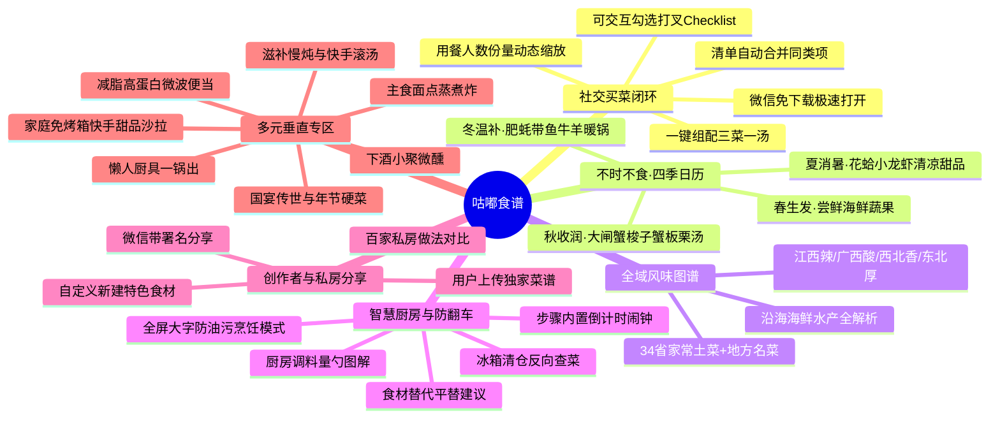
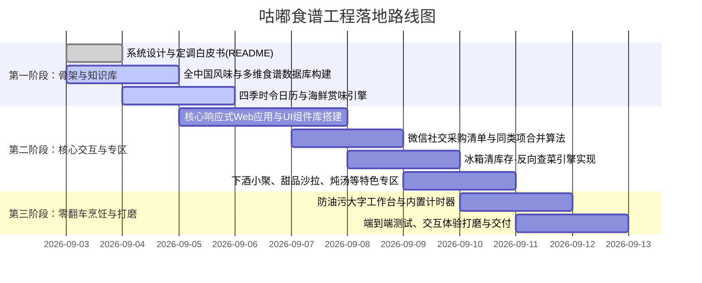

# 🍲 咕嘟食谱 (Gudu Recipe) - 产品架构与设计定调白皮书

> **“食物咕嘟咕嘟，生活热气腾腾。”**  
> 一款融合**全中华地道风味、四季不时不食、微信社交买菜闭环、智能冰箱清库存与零翻车烹饪**的国民级现代美食生活指南。

---

## 目录
- [一、 产品定位与核心愿景](#一-产品定位与核心愿景)
- [二、 核心特色与用户痛点破局](#二-核心特色与用户痛点破局)
- [三、 全景内容矩阵与分类体系](#三-全景内容矩阵与分类体系)
  - [3.1 全中华 34 省级行政区风味版图](#31-全中华-34-省级行政区风味版图地道家常与代表大菜并重)
  - [3.2 沿海海鲜水产独立专区](#32-沿海海鲜水产独立专区)
  - [3.3 “不时不食”四季时令日历](#33-不时不食四季时令日历与海鲜蔬果赏味期)
  - [3.4 家庭免烤箱快手甜品与蔬果沙拉](#34-家庭免烤箱快手甜品与蔬果沙拉专区)
  - [3.5 朋友小聚·微醺下酒菜专区](#35-朋友小聚微醺下酒菜专区)
  - [3.6 滋补炖汤、主食面点、减脂轻食与懒人厨具专区](#36-滋补炖汤主食面点减脂轻食与懒人厨具专区)
  - [3.7 国宴名菜、非遗名吃与年节家宴硬菜专区](#37-国宴名菜非遗名吃与年节家宴硬菜专区)
- [四、 智能交互与特色功能设计](#四-智能交互与特色功能设计)
  - [4.1 微信社交买菜闭环 (三菜一汤组合与采购清单合并)](#41-微信社交买菜闭环-三菜一汤组合与采购清单合并)
  - [4.2 冰箱清库存·反向查菜引擎](#42-冰箱清库存反向查菜引擎)
  - [4.3 零翻车烹饪工作台 (防油污大字模式 + 内置计时器)](#43-零翻车烹饪工作台-防油污大字模式--内置计时器)
  - [4.4 用户自创菜谱与私房做法分享 (UGC 创作与新食材扩充)](#44-用户自创菜谱与私房做法分享-ugc-创作与新食材扩充)
- [五、 标准化食谱数据规范 (Recipe Data Schema)](#五-标准化食谱数据规范-recipe-data-schema)
- [六、 视觉调性与 UI/UX 设计语言](#六-视觉调性与-uiux-设计语言)
- [七、 研发与功能实施路线图 (Roadmap)](#七-研发与功能实施路线图-roadmap)

---

## 一、 产品定位与核心愿景

### 1.1 核心理念：海纳百川，全客群全场景覆盖
中华美食博大精深，用户的做饭需求也是多层次、全场景的：
* **日常与下班**：需要地道市井家常小炒、15分钟快手菜、减脂便当；
* **周末与聚会**：需要微醺下酒菜、家庭快手甜品、沿海应季海鲜；
* **逢年过节与隆重家宴**：需要能够镇得住场面的**国宴名菜、非遗名吃、年夜饭压轴硬菜**（如开水白菜、佛跳墙、松鼠鳜鱼、文思豆腐、葱烧海参、红烧狮子头等）。许多烹饪爱好者、家庭大厨在春节、中秋、寿宴或亲友聚餐时，极度渴望挑战并还原这些传世大菜。

因此，「咕嘟食谱」坚持**“无偏见、全包容、全客群覆盖”**——不仅深耕市井人间烟火，也精心收录并以保姆级教程拆解**国宴代表大菜与隆重宴席硬菜**，满足从厨房新手到高阶大厨的所有进阶与节庆需求。

### 1.2 咕嘟食谱的核心使命
「咕嘟食谱」以**“好买、好做、好吃、好分享”**为核心，打造一款全能型国民级美食生活指南：
* **风味全覆盖**：国宴传世大菜与市井家常土菜并重，全面涵盖 34 个省级行政区地道风味（深耕江西鲜辣、广西酸笋果香、西北面食牛羊、塞北草原、东北黑土、沿海海鲜、国宴名菜等）；
* **买菜社交闭环**：一键拼配“三菜一汤/宴席菜单”，微信分享免下载，买菜清单自动合并同类项，带打勾划线 Checklist；
* **智慧厨房管家**：冰箱剩菜反向查菜、食材可替换推荐、调料量勺可视化、内置步骤倒计时、全屏大字防油污模式。

---

## 二、 核心特色与用户痛点破局



---

## 三、 全景内容矩阵与分类体系

### 3.1 全中华 34 省级行政区风味版图（地道家常与代表大菜并重）

| 区域分区 | 涵盖省份/地区 | 核心风味特征 | 经典大菜 + 地道市井家常代表（全收录） |
| :--- | :--- | :--- | :--- |
| **东南水乡与沿海** | **广东、香港、澳门、福建、海南** | 清鲜爽脆、原汁原味、煲汤养生、海味鲜醇 | 白切鸡、广式煲仔饭、潮汕牛肉火锅、客家酿豆腐、脆皮烧肉、清蒸多宝鱼；闽菜佛跳墙、荔枝肉、同安封肉；海南椰子鸡、糟粕醋海鲜锅 |
| **西南热辣酸爽** | **四川、重庆、湖南、贵州、云南** | 麻辣鲜香、香辣暴炒、酸汤生津、山珍果香 | 麻婆豆腐、小炒黄牛肉、剁椒鱼头、家常擂辣椒皮蛋、盐煎肉、酸辣土豆丝；贵州酸汤鱼、折耳根拌腊肉；云南汽锅鸡、黑三剁、洋芋焖饭 |
| **华南鲜辣酸香** | **江西、广西** | 鲜辣生猛、酸笋果香、瓦罐煨汤、醇厚下饭 | **江西**：余干辣椒炒肉、南昌瓦罐肉饼汤、莲花血鸭、家常炒米粉、绝味炒鸭掌、南昌炒藕片；<br>**广西**：酸笋紫苏炒牛肉、地道柠檬鸭、老友炒猪杂、荔浦芋头扣肉、北海烤生蚝 |
| **西北面食豪爽** | **陕西、甘肃、宁夏、青海** | 焦香油泼、面香筋道、酸辣醇厚、牛羊纯正 | 陕西肉夹馍、油泼扯面、羊肉泡馍、臊子面、葫芦鸡；兰州牛肉拉面、手抓羊肉、宁夏烩羊杂、青海土火锅 |
| **塞外草原西域** | **内蒙古、新疆** | 孜然浓香、纯正乳香、大火烤炙、大口吃肉 | **新疆**：大盘鸡、羊肉手抓饭、烤羊肉串、椒麻鸡、烤包子、皮辣红；<br>**内蒙古**：手把肉、烤羊排、奶豆腐、风干牛肉、内蒙羊杂碎汤 |
| **东北黑土酱香** | **黑龙江、吉林、辽宁** | 咸香浓郁、份量实在、酱香酥嫩、开胃下饭 | 锅包肉、猪肉炖粉条、小鸡炖蘑菇、地三鲜、溜肉段、排骨炖油豆角、肉末炒酸菜粉条、东北自制大拉皮 |
| **江南精致温婉** | **江苏、浙江、上海、安徽** | 咸甜适口、糟醉清雅、刀工火候、浓油赤酱 | 西湖醋鱼、东坡肉、龙井虾仁、绍兴醉鸡；松鼠鳜鱼、大煮干丝、红烧狮子头、上海红烧肉；徽州臭鳜鱼、刀板香 |
| **中原华北齐鲁** | **山东、北京、天津、河南、河北** | 葱香咸鲜、酱香浓郁、善用吊汤、大馅面食 | 鲁菜葱烧海参、九转大肠、糖醋鲤鱼、油爆双脆；北京烤鸭、老北京炸酱面；天津嘎巴菜、家常大卤面；河南胡辣汤、羊肉烩面、蒸卤面 |

---

### 3.2 沿海海鲜水产独立专区

海鲜不仅按食材分类，更按**“最佳烹饪法”与“鲜味锁水技巧”**展开：

1. **品类细分**：
   * **虾蟹类**：基围虾、罗氏虾、皮皮虾（虾爬子）、青蟹、梭子蟹、大闸蟹；
   * **贝螺类**：花甲、生蚝、扇贝、带子、花螺、蛏子、鲍鱼（附带：**独家快速吐沙法与火候控制**）；
   * **海鱼类**：多宝鱼、鲈鱼、黄花鱼、带鱼、鲳鱼、石斑鱼；
   * **软体水产**：鱿鱼、八爪鱼、墨鱼。
2. **风味技法专线**：
   * **清蒸白灼**（几斤几两精准计时蒸几分钟，多 30 秒都老）；
   * **葱姜酱爆 / 避风塘香酥**（镬气十足、吮指留香）；
   * **生滚海鲜砂锅粥**（米油浓稠、虾蟹清甜）；
   * **夏日捞汁小海鲜**（酸辣冰爽夜市爆款）。

---

### 3.3 “不时不食”四季时令日历（与海鲜蔬果赏味期）

| 季节与节气 | 核心食养理念 | 时令海鲜水产推荐 | 时令蔬菜与招牌家常菜 |
| :--- | :--- | :--- | :--- |
| **🌸 春·生**（立春~立夏） | 升发阳气、尝鲜尝嫩、护肝健脾 | 谷雨春鲅鱼、带籽母皮皮虾、清明螺蛳、春带鱼 | 春笋腌笃鲜、香椿炒土鸡蛋、荠菜豆腐羹、春韭炒河虾 |
| **☀️ 夏·长**（立夏~立秋） | 清热消暑、生津开胃、健脾祛湿 | 盛夏肥花蛤、潜江小龙虾、蛏子、鲜鲍鱼、黄油蟹 | 苦瓜黄豆排骨汤、冬瓜薏米老鸭汤、清炒丝瓜、凉拌酸辣藕带 |
| **🍂 秋·收**（立秋~立冬） | 润燥防凉、秋风肥美、贴秋膘 | 阳澄湖大闸蟹（母蟹黄满）、东海梭子蟹、鲜对虾、生蚝起肥 | 洪湖莲藕排骨汤、板栗烧土鸡、茭白炒肉丝、银耳百合雪梨盅 |
| **❄️ 冬·藏**（立冬~立春） | 温中散寒、固本培元、热气暖锅 | 冬捕胖头鱼、冬蚝奶甜（生蚝最肥）、胶东刀鱼、鲜海蛎子 | 铜锅涮羊肉、萝卜炖牛腩、东北酸菜白肉血肠、冬笋炒腊肉 |

---

### 3.4 家庭免烤箱快手甜品与蔬果沙拉专区

**宗旨：无需专业烤箱，只要小奶锅、大碗、保鲜盒，手残党 5~15 分钟零翻车搞定。**

* **凉粉与冰品果冻系列**：
  * 水果水晶果冻（白凉粉 + 当季水果粒）；
  * 川味红糖冰粉（红糖浆 + 花生碎 + 山楂碎 + 醪糟小圆子）；
  * 桂花茶冻 / 茉莉奶冻；
  * 黑凉粉仙草红豆捞。
* **蔬果沙拉与万能低卡酱汁**：
  * **酱汁公式库**：万能油醋汁（橄榄油:果醋:黑胡椒=3:1:适量）、低卡酸奶蜂蜜酱、日式焙煎芝麻汁；
  * **轻食沙拉碗**：香煎鸡胸肉彩椒沙拉、细腻低脂土豆泥沙拉、泰式酸辣青芒拌水果。
* **家常中式快手糖水**：
  * 经典双皮奶（纯牛奶 + 蛋清，蒸锅 10 分钟）；
  * 顺德姜撞奶（把控 75℃ 冲入温度指南）；
  * 桂花酒酿小圆子、杨枝甘露简易家常版。

---

### 3.5 朋友小聚·微醺下酒菜专区

**宗旨：做饭人不用整晚守在油烟厨房，冷盘先上桌，边喝边聊，热炒秒出锅！**

* **招牌提前卤味冷盘**：
  * 五香酱牛肉 / 卤牛腱子（**冷藏后再切片不碎的独门技巧**）；
  * 柠檬酸辣无骨鸡爪、泡椒凤爪、卤脆猪耳朵、自制五香糟毛豆。
* **热辣爆炒镬气菜**：
  * 紫苏酱爆田螺、香辣爆炒花甲、牙签牛肉、干煸肥肠、歌乐山辣子鸡。
* **极速下酒神仙伴侣**：
  * 酥脆油炸花生米（**冷锅冷油下锅、出锅喷白酒防回潮绝技**）；
  * 刀拍黄瓜拌老醋花生。
* **酒品搭配与微信小聚邀请卡**：
  * 配冰啤酒 / 配醇香白酒 / 配微醺果酒精准搭配推荐；
  * 一键生成“今晚来我家喝酒”微信邀请卡，支持朋友点卡片**“认领买酒/带凉菜”**任务。

---

### 3.6 滋补炖汤、主食面点、减脂轻食与懒人厨具专区

* **🍲 炖汤专区**：
  * **老火慢煲**（砂锅煲 1.5~2 小时，排骨玉米、花胶乌鸡、山药老鸭，严格标注入水时机与盐后放原则）；
  * **10分钟快手滚汤**（番茄浓汤煎蛋汤、丝瓜肉片生滚汤、西湖牛肉羹）。
* **🥟 主食面点专区**：
  * **蒸**：手工鲜肉包子、刀切红糖馒头、玉米发糕（面粉/水/酵母比例黄金公式）；
  * **煮**：陕西油泼面、北方家常水饺、老北京炸酱面、广式云吞面；
  * **炸**：香酥油条、家常春卷、葱油饼。
* **🏃 减脂独立专区**：
  * 每道菜标注预估卡路里（kcal）与蛋白质含量，精选“耐微波加热、隔夜蔬菜不泛黄”的打工人带饭食谱。
* **🍳 懒人厨具专区**：
  * **空气炸锅**：烤鸡翅（180度正面12分+翻面8分）、时蔬烘蛋、烤红薯；
  * **电饭煲一锅焖**：广式香肠土豆焖饭、电饭煲焗整鸡；
  * **一口平底锅**：无水焗排骨、抱蛋煎饺。

---

### 3.7 国宴名菜、非遗名吃与年节家宴硬菜专区

**宗旨：为家庭大厨、厨艺进阶者、春节年夜饭、中秋家宴量身打造，以现代家庭厨房为基准，拆解传世名菜与压轴硬菜！**

* **国宴传奇与清汤吊汤绝学**：
  * **开水白菜**（国宴川菜天花板，用鸡肉茸扫汤“红白二茸”吊出清澈见底却鲜香扑鼻的高汤）；
  * **软兜长鱼 / 淮扬狮子头**（七分瘦三分肥、文火慢炖出入口即化的国宴标准）。
* **四大名旦与压轴海味硬菜**：
  * **闽菜之王·佛跳墙**（鲍汁浓汤熬制、花胶海参蹄筋层层煨透的大师拆解版）；
  * **鲁菜之冠·葱烧海参**（大葱炸金黄制葱油、浓汁煨海参锁住葱香）；
  * **苏帮传统·松鼠鳜鱼**（牡丹花刀改刀技巧、180℃定型炸制、黄金糖醋汁浇汁吱吱作响）；
  * **京华风味·北京烤鸭家庭脆皮版**（脆皮水调制比例、风干技巧与家庭烤箱温控）。
* **年节团圆硬席压轴菜**：
  * 富贵花开东坡肘子、黄金鸿运大闸蟹煲、步步高升清蒸石斑鱼、招牌年夜饭吉祥大拼盘。
* **国宴专区专属赋能**：
  * **“大师手法分解”**：高难度刀工（如菊花豆腐/文思豆腐切丝技巧）、挂糊定型油温、老汤吊制流程；
  * **“家庭厨房替代解法”**：没有饭店大口猛火灶，教普通燃气灶如何借用铸铁锅/砂锅蓄热锁味。

---

## 四、 智能交互与特色功能设计

### 4.1 微信社交买菜闭环 (三菜一汤组合与采购清单合并)
1. **组装菜单**：用户可在单菜页面或通过“组合三菜一汤”浮动托盘自由拼配。
2. **清单合并同类项引擎**：
   * 若菜品 A 需“番茄 2 个、生抽 1 勺”，菜品 B 需“番茄 2 个、鸡蛋 3 个、生抽 2 勺”；
   * 微信落地页自动合并生成：
     * 🥬 **生鲜蔬菜**：番茄 × 4个、鸡蛋 × 3个；
     * 🧂 **厨房调料**：生抽 × 3勺（可勾选“家里常备，忽略”）。
3. **交互式 Checklist**：
   * 好友在菜市场/超市点开链接，买好一项点一下，实时**打勾划掉变灰**，永不漏买。
4. **人数份量倍率器**：
   * 支持一键切换【2人份 / 4人份 / 6人份】，所有原料用量等比动态缩放。

---

### 4.2 冰箱清库存·反向查菜引擎
1. **食材勾选盘**：分类列出家里常备肉蛋、果蔬、水产、豆制品。
2. **三级智能匹配算法**：
   * 🟢 **完美匹配 (100%)**：现有食材 + 基础调料即可直接烹饪；
   * 🟡 **微缺辅料 (80%)**：只差 1~2 样常见配菜（如差一根葱或一根青椒），点击一键将缺少的辅料加入买菜清单；
   * ⚪ **衍生建议**：推荐能消耗剩余小半块食材的搭配方案。

---

### 4.3 零翻车烹饪工作台 (防油污大字模式 + 内置计时器)
* **分步大字卡片**：单手手背或手肘轻轻一碰即可“上一步/下一步”，手机横屏摆放远看清清楚楚。
* **常亮防休眠**：进入烹饪模式后屏幕不自动锁屏黑屏。
* **步骤内置计时器**：“盖盖焖煮 15 分钟”，步骤旁带 `[⏱️ 启动15分钟倒计时]` 按钮，震动/声音提示。
* **大厨避坑指南 (Chef's Tips)**：标红关键翻车点（如火候、下盐时机、肉质切法）。

---

### 4.4 用户自创菜谱与私房做法分享 (UGC 创作与新食材扩充)

**宗旨：不仅收录天下名菜，更赋能千家万户的大厨！支持用户自由记录、上传独门做法与地方生僻食材，让地道美味在微信好友间自由流转。**

1. **零门槛创建菜谱（手机端极简表单）**：
   * **基础信息**：上传菜品美图、菜名、所属省份风味、适宜季节与难度；
   * **食材与用量自定义**：支持直接从现有食材库中点选，也**支持用户直接输入并新建未知的新食材**（如老家特产的野生菌、地方特色野菜、自制酸腌菜等），系统自动沉淀扩充食材总库；
   * **调料勺量规范**：提供标准量勺组件（几勺生抽、几小茶匙白糖），小白照着录入不费劲；
   * **分步图文与心得**：一步一图，可附带作者本人的“防翻车独家秘笈”。
2. **私房菜谱一键分享至微信**：
   * 用户发布的私房菜谱会打上专属作者认证标签（如：`👨‍🍳 @王大厨 的独家私房菜`）；
   * 同样享受全套微信生态赋能：好友点开链接免下载浏览、自动生成智能买菜 Checklist、份量动态缩放。
3. **“百家做法”聚合对比**：
   * 同一道菜（如“红烧肉”或“酸笋炒牛肉”），用户不仅能查看官方经典做法，还能点击【查看更多家常私房版本】；
   * 看看湖南老表的辣炒版、上海人浓油赤酱不放水版、广西老乡的酸笋版，百家争鸣，让菜谱真正活起来！

---

## 五、 标准化食谱数据规范 (Recipe Data Schema)

为保证海量菜品数据的规范性与多维检索能力，系统采用统一的 JSON Schema：

```typescript
interface Recipe {
  id: string;                      // 唯一ID，如 "rec_gxb_001"
  name: string;                    // 菜名，如 "酸笋紫苏炒牛肉"
  subtitle: string;                // 治愈短描述，如 "镬气十足，酸辣开胃两碗饭"
  region: string;                  // 省份/菜系，如 "广西"
  cuisineCategory: string;         // 菜系分类，如 "桂菜"
  categoryType: "dish" | "soup" | "noodle" | "dessert" | "salad" | "snack"; // 菜品类型
  flavor: string[];                // 口味标签，如 ["酸辣", "镬气", "爆炒"]
  cookingMethod: string;           // 烹饪方式，如 "爆炒"
  difficulty: "新手友好" | "家常快手" | "大厨进阶"; // 难度
  prepTimeMinutes: number;         // 备菜耗时（分钟）
  cookTimeMinutes: number;         // 炒制耗时（分钟）
  servings: number;                // 默认基准人份（如 2人份）
  caloriesKcal?: number;           // 预估热量
  season: ("spring" | "summer" | "autumn" | "winter")[]; // 适宜季节
  seasonalityBadge?: string;       // 时令特色标签，如 "夏秋当季·开胃解暑"
  isSeafood: boolean;              // 是否海鲜水产
  isDrinkingSnack: boolean;        // 是否下酒菜
  isFatLossFriendly: boolean;      // 是否减脂友好
  isGrandBanquet: boolean;         // 是否国宴名菜/年节压轴硬菜
  isUGC: boolean;                  // 是否用户自创菜谱
  authorName?: string;             // 创作者昵称（如 "官方甄选" 或 "@王大厨"）
  appliance: string[];             // 适用厨具，如 ["平底锅", "铁锅"]
  
  // 核心食材清单（支持换算与替换）
  ingredients: {
    name: string;                  // 食材名称，如 "牛里脊"
    amount: number;                // 基准用量数值，如 250
    unit: string;                  // 单位，如 "克"
    type: "main" | "secondary";    // 主料 / 辅料
    substitutes?: string[];        // 建议可替换食材，如 ["牛柳", "猪里脊"]
  }[];

  // 调味料清单（量勺化）
  seasonings: {
    name: string;                  // 调料名称，如 "生抽"
    amountText: string;            // 规范量勺，如 "1 瓷汤勺 (约 15ml)"
    baseAmount: number;            // 基准数值（方便倍率计算）
    unit: string;                  // 如 "勺"
    isPantryStaple: boolean;       // 是否厨房常备（用于过滤买菜清单）
  }[];

  // 烹饪步骤
  steps: {
    stepIndex: number;
    title: string;                 // 步骤小标题，如 "牛肉逆纹切与上浆"
    instruction: string;           // 详尽操作说明
    timerSeconds?: number;         // 内置倒计时秒数（若有时）
    chefTip?: string;              // 避坑防翻车要点
  }[];

  // 微信分享与微醺拓展
  drinkingPairing?: string;        // 最佳酒品搭配建议，如 "冰镇拉格啤酒/清爽气泡水"
  pantryChecklistTags: string[];   // 用于冰箱匹配的归一化标签，如 ["牛肉", "酸笋"]
}
```

---

## 六、 视觉调性与 UI/UX 设计语言

* **主色调**：
  * **咕嘟暖橙** (`#FF6B35` / `#E85D04`)：充满烟火气的陶土暖橙，象征砂锅沸腾与炉火温润；
  * **米白暖杏** (`#FDFBF7` / `#FFF8F0`)：柔和不刺眼的米白底色，兼具阅读舒适度与高级杂志感；
  * **焦糖墨棕** (`#2B1B17` / `#4A3B32`)：用于标题文字，温润雅致，替代生硬的纯黑；
  * **生机翠绿** (`#2A9D8F`)：用于标注时令蔬菜、低卡健康与采购已勾选状态。
* **排版风格**：圆润精致的大圆角（16px~24px）、轻微柔和的高斯模糊阴影、符合移动端手指点按的大触控面积。
* **动效细节**：点击加入采购单的小红点平滑抛物线动效、勾选买菜项时的划线变灰微动效、计时器环形倒计时动画。

---

## 七、 研发与功能实施路线图 (Roadmap)



---

> 📄 **文档版本**：v1.0.0 (定调归档)  
> 💡 **后续演进原则**：随着业务扩展与用户反馈，功能新增与数据扩充均以本说明书作为核心基准，持续迭代完善。
